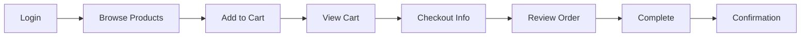

# Test Plan - Sauce Demo E2E Automation

**Application:** [Sauce Demo](https://www.saucedemo.com/)  
**Framework:** Playwright + TypeScript  
**Architecture:** Component Object Model (COM)  
**Last Updated:** 2025-12-15  
**Total Tests:** 41

---

## 📋 Quick Links
- [Test Cases](TESTCASES.md) - Detailed test case documentation
- [README](README.md) - Project overview and setup
- [AI Test Standards](AI_TEST_STANDARDS.md) - Coding standards

---

## 🎯 Test Scope

### In Scope
- ✅ User authentication (login/logout)
- ✅ Product browsing and sorting
- ✅ Shopping cart operations
- ✅ Complete checkout flow
- ✅ Form validation and error handling
- ✅ Navigation and UI interactions
- ✅ Edge cases and boundary testing
- ✅ Different user personas

### Out of Scope
- ❌ API testing (no backend APIs exposed)
- ❌ Performance/load testing
- ❌ Mobile responsive testing
- ❌ Cross-browser testing (Chromium only)
- ❌ Accessibility testing

---

## 🧪 Test Strategy

### Architecture Principles
Following **AI_TEST_STANDARDS.md**:
- **Component Object Model:** Composable page objects
- **Custom Fixtures:** Dependency injection
- **User-Facing Locators:** `getByRole`, `getByLabel`, `getByPlaceholder`
- **Web-First Assertions:** Auto-waiting, no hard waits
- **Strict TypeScript:** No `any` types

### Test Levels
| Level | Tag | Count | Purpose |
|-------|-----|-------|---------|
| Smoke | `@smoke` | 7 | Critical happy paths |
| Regression | `@regression` | 34+ | Full feature coverage |
| Negative | `@negative` | 6+ | Error scenarios |
| Edge Cases | `@edge` | 7 | Boundary conditions |
| E2E | `@e2e` | 3 | End-to-end flows |

---

## 🌐 Test Environment

| Environment | URL | Browser | Viewport |
|------------|-----|---------|----------|
| Production | https://www.saucedemo.com/ | Chromium | 1280x720 |

**Configuration:**
- Headless: CI/CD
- Headed: Local development
- Timeout: 30s (default)
- Retries: 2 (CI), 0 (local)

---

## 📊 Test Data

### Test Users

| Username | Password | Purpose | Behavior |
|----------|----------|---------|----------|
| `standard_user` | `secret_sauce` | Happy path | Normal functionality |
| `locked_out_user` | `secret_sauce` | Negative testing | Login blocked |
| `problem_user` | `secret_sauce` | Visual bugs | UI issues |
| `performance_glitch_user` | `secret_sauce` | Performance | Slow loads |
| `error_user` | `secret_sauce` | Error scenarios | Checkout errors |
| `visual_user` | `secret_sauce` | Visual regression | Visual differences |

### Test Products

| Product | Price | Use Case |
|---------|-------|----------|
| Sauce Labs Backpack | $29.99 | Single item |
| Sauce Labs Bike Light | $9.99 | Lowest price |
| Sauce Labs Bolt T-Shirt | $15.99 | Mid-range |
| Sauce Labs Fleece Jacket | $49.99 | Highest price |
| Sauce Labs Onesie | $7.99 | Multiple items |
| Test.allTheThings() T-Shirt (Red) | $15.99 | Sorting tests |

### Checkout Data

```typescript
Valid: { firstName: "John", lastName: "Doe", postalCode: "12345" }
Invalid: { firstName: "", lastName: "", postalCode: "" }
Special Chars: { firstName: "John-O'Brien", lastName: "Van Der Berg", postalCode: "12345-6789" }
Long Values: { firstName: "A".repeat(100), lastName: "A".repeat(100), postalCode: "1".repeat(50) }
```

---

## 🚀 Critical User Journeys

### 1. Complete Purchase Flow
**Priority:** P0 | **Tags:** `@smoke` `@e2e`



**Test Cases:** TC-008, TC-020, TC-034

---

### 2. Authentication & Authorization
**Priority:** P0 | **Tags:** `@smoke` `@auth`

**Scenarios:**
- Valid login → Inventory page
- Invalid credentials → Error message
- Empty fields → Validation error
- Locked user → Access denied
- Logout → Return to login
- Direct URL access → Redirect to login

**Test Cases:** TC-001, TC-002, TC-003, TC-004, TC-018, TC-021

---

### 3. Shopping Cart Management
**Priority:** P1 | **Tags:** `@regression` `@cart`

**Operations:**
- Add items (single/multiple/all)
- Remove items (single/all)
- Add/remove same item repeatedly
- Cart persistence across navigation
- Cart badge updates

**Test Cases:** TC-005, TC-006, TC-007, TC-013, TC-017, TC-022, TC-028, TC-030

---

### 4. Product Browsing & Sorting
**Priority:** P1 | **Tags:** `@regression` `@products`

**Features:**
- Product listing display
- Sorting (Name A-Z, Z-A, Price Low-High, High-Low)
- Sorting persistence/reset behavior
- Product detail view
- Product images validation
- Price format validation

**Test Cases:** TC-010, TC-011, TC-012, TC-025, TC-029, TC-032

---

### 5. Checkout Flow
**Priority:** P0 | **Tags:** `@regression` `@checkout`

**Scenarios:**
- Form validation (missing fields)
- Cancel checkout (info/overview pages)
- Special characters in forms
- Very long input values
- Browser refresh handling
- Multiple items checkout

**Test Cases:** TC-009, TC-023, TC-024, TC-027, TC-031, TC-033, TC-034

---

### 6. Navigation
**Priority:** P2 | **Tags:** `@regression` `@navigation`

**Features:**
- Burger menu (All Items, About, Logout, Reset)
- External link navigation
- Cart navigation
- Back button behavior

**Test Cases:** TC-026, TC-035, TC-019

---

### 7. Error Handling & Edge Cases
**Priority:** P2 | **Tags:** `@edge` `@negative`

**Scenarios:**
- Problem user visual issues
- Performance glitch user
- Error user checkout failure
- Browser back button
- App state reset

**Test Cases:** TC-014, TC-015, TC-016, TC-019

---

## 📈 Test Execution Plan

### Local Execution
```bash
# All tests
npm test

# Smoke tests only
npm run test:smoke

# Specific suite
npm run test:auth
npm run test:cart
npm run test:checkout
npm run test:products

# By tag
npx playwright test --grep @regression
npx playwright test --grep @negative
```

### CI/CD Execution
- **Trigger:** Push to main, Pull requests
- **Environment:** GitHub Actions
- **Browser:** Chromium (headless)
- **Retries:** 2
- **Reports:** HTML, JSON
- **Artifacts:** Screenshots, videos (on failure)

---

## ✅ Success Criteria

### Test Execution
- ✅ All 41 tests passing
- ✅ Pass rate: 100%
- ✅ Execution time: < 2 minutes
- ✅ No flaky tests

### Code Quality
- ✅ TypeScript strict mode compliant
- ✅ No hard waits (`page.waitForTimeout()`)
- ✅ Web-first assertions throughout
- ✅ Follows AI_TEST_STANDARDS.md
- ✅ No lint errors

### Documentation
- ✅ All test cases documented
- ✅ README up to date
- ✅ Test plan current

---

## ⚠️ Risks & Mitigation

| Risk | Impact | Probability | Mitigation |
|------|--------|-------------|------------|
| Application changes | High | Medium | Regular test maintenance |
| Flaky tests | Medium | Low | Proper waits, stable locators |
| Environment issues | Medium | Low | Retry logic, error handling |
| Test data changes | Low | Low | Use dynamic selectors |

---

## 📊 Test Coverage Summary

| Suite | Tests | Coverage |
|-------|-------|----------|
| Authentication | 7 | Login, logout, validation |
| Shopping Cart | 8 | Add, remove, persistence |
| Checkout | 10 | Complete flow, validation, edge cases |
| Products | 11 | Browsing, sorting, details |
| Edge Cases | 5 | Special users, error handling |
| **Total** | **41** | **Comprehensive E2E coverage** |

---

## 📚 Related Documentation

- **[TESTCASES.md](TESTCASES.md)** - Detailed test case steps
- **[README.md](README.md)** - Project setup and overview
- **[AI_TEST_STANDARDS.md](AI_TEST_STANDARDS.md)** - Coding standards
- **[.github/GITHUB_ACTIONS_SETUP.md](.github/GITHUB_ACTIONS_SETUP.md)** - CI/CD setup

---

**For detailed test case steps, see [TESTCASES.md](TESTCASES.md)**
