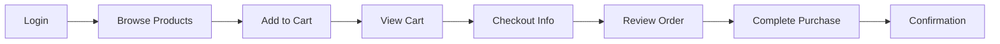

# Test Plan - Sauce Demo E2E Automation

**Application Under Test:** [Sauce Demo](https://www.saucedemo.com/)  
**Framework:** Playwright with TypeScript  
**Test Approach:** Page Object Model (POM)  
**Created:** 2025-12-13  
**Version:** 1.0

---

## 📋 Table of Contents

1. [Test Scope](#test-scope)
2. [Test Strategy](#test-strategy)
3. [Test Environment](#test-environment)
4. [Test Data](#test-data)
5. [Critical User Journeys](#critical-user-journeys)
6. [Detailed Test Scenarios](#detailed-test-scenarios)
7. [Page Objects Required](#page-objects-required)
8. [Test Execution Plan](#test-execution-plan)
9. [Success Criteria](#success-criteria)
10. [Risks & Mitigation](#risks--mitigation)

---

## 🎯 Test Scope

### In Scope
- ✅ User authentication (login/logout)
- ✅ Product browsing and filtering
- ✅ Shopping cart operations
- ✅ Complete checkout flow
- ✅ Error handling and validation
- ✅ Different user personas testing
- ✅ UI state management

### Out of Scope
- ❌ API testing (no backend APIs exposed)
- ❌ Performance/load testing (beyond `performance_glitch_user`)
- ❌ Mobile responsive testing (desktop focus)
- ❌ Cross-browser testing (Chromium primary)
- ❌ Accessibility testing (future enhancement)

---

## 🧪 Test Strategy

### Architecture Principles
Following **AI_TEST_STANDARDS.md**:
- **Page Object Model (POM):** All locators in `/pages` directory
- **User-Facing Locators:** Prioritize `getByRole`, `getByLabel`, `getByPlaceholder`
- **Web-First Assertions:** Auto-waiting with `expect(locator).toBeVisible()`
- **No Hard Waits:** Forbidden to use `page.waitForTimeout()`
- **Strict TypeScript:** No `any` types, explicit typing required

### Test Levels
1. **Smoke Tests** - Critical happy paths (`@smoke` tag)
2. **Regression Tests** - Full feature coverage (`@regression` tag)
3. **Negative Tests** - Error scenarios (`@negative` tag)
4. **Edge Cases** - Boundary conditions (`@edge` tag)

---

## 🌐 Test Environment

| Environment | URL | Purpose |
|------------|-----|---------|
| Production | https://www.saucedemo.com/ | Primary test environment |

**Browser Configuration:**
- Primary: Chromium (headless for CI, headed for local)
- Viewport: 1280x720 (desktop)
- Timeout: 30s (default)

---

## 📊 Test Data

### Test Users

| Username | Password | Purpose | Expected Behavior |
|----------|----------|---------|-------------------|
| `standard_user` | `secret_sauce` | Happy path testing | Normal functionality |
| `locked_out_user` | `secret_sauce` | Negative testing | Login blocked with error |
| `problem_user` | `secret_sauce` | Visual bug testing | UI/functional issues |
| `performance_glitch_user` | `secret_sauce` | Performance testing | Slow page loads |
| `error_user` | `secret_sauce` | Error scenario testing | Checkout errors |
| `visual_user` | `secret_sauce` | Visual regression | Visual differences |

### Test Products

| Product Name | Price | Use Case |
|--------------|-------|----------|
| Sauce Labs Backpack | $29.99 | Single item purchase |
| Sauce Labs Bike Light | $9.99 | Lowest price item |
| Sauce Labs Bolt T-Shirt | $15.99 | Mid-range item |
| Sauce Labs Fleece Jacket | $49.99 | Highest price item |
| Sauce Labs Onesie | $7.99 | Multiple item testing |

### Checkout Data

```typescript
const validCheckoutData = {
  firstName: "John",
  lastName: "Doe",
  postalCode: "12345"
};

const invalidCheckoutData = {
  firstName: "",
  lastName: "",
  postalCode: ""
};
```

---

## 🚀 Critical User Journeys

### Journey 1: Complete Purchase Flow (Happy Path)
**Priority:** CRITICAL | **Tag:** `@smoke` `@e2e`

**User Story:** As a customer, I want to purchase products so that I can complete my shopping.

**Flow:**


---

### Journey 2: Authentication & Authorization
**Priority:** CRITICAL | **Tag:** `@smoke` `@auth`

**User Story:** As a system, I need to authenticate users and control access to protected pages.

**Scenarios:**
- Valid login → Inventory page
- Invalid credentials → Error message
- Locked user → Access denied
- Logout → Return to login
- Direct URL access without auth → Redirect to login

---

### Journey 3: Shopping Cart Management
**Priority:** HIGH | **Tag:** `@regression` `@cart`

**User Story:** As a customer, I want to manage my cart so that I can control my purchases.

**Operations:**
- Add items (single/multiple)
- Remove items
- Update quantities (implicit via add/remove)
- Continue shopping
- Verify cart persistence across navigation

---

### Journey 4: Product Browsing & Filtering
**Priority:** HIGH | **Tag:** `@regression` `@products`

**User Story:** As a customer, I want to browse and filter products so that I can find what I need.

**Features:**
- Product listing display
- Sorting (Name A-Z, Z-A, Price Low-High, High-Low)
- Product detail view
- Add to cart from inventory/detail pages

---

### Journey 5: Error Handling & Edge Cases
**Priority:** MEDIUM-HIGH | **Tag:** `@negative` `@edge`

**User Story:** As a system, I need to handle errors gracefully to maintain user trust.

**Scenarios:**
- Form validation errors
- Problem user behaviors
- Performance degradation handling
- Reset app state functionality

---

## 📝 Detailed Test Scenarios

### **TC-001: Successful Login with Standard User**
**Priority:** P0 | **Tags:** `@smoke` `@auth`

| Step | Action | Expected Result |
|------|--------|----------------|
| 1 | Navigate to https://www.saucedemo.com/ | Login page displays |
| 2 | Enter username: `standard_user` | Username field populated |
| 3 | Enter password: `secret_sauce` | Password field populated (masked) |
| 4 | Click "Login" button | Redirected to `/inventory.html` |
| 5 | Verify inventory page loads | Products grid visible, cart icon present |

**Assertions:**
```typescript
await expect(page).toHaveURL(/.*inventory.html/);
await expect(inventoryPage.productsGrid).toBeVisible();
await expect(inventoryPage.cartBadge).toBeVisible();
```

---

### **TC-002: Login Failure - Locked Out User**
**Priority:** P0 | **Tags:** `@smoke` `@negative` `@auth`

| Step | Action | Expected Result |
|------|--------|----------------|
| 1 | Navigate to login page | Login page displays |
| 2 | Enter username: `locked_out_user` | Username field populated |
| 3 | Enter password: `secret_sauce` | Password field populated |
| 4 | Click "Login" button | Error message displayed |
| 5 | Verify error message | "Epic sadface: Sorry, this user has been locked out." |
| 6 | Verify still on login page | URL remains `/` |

**Assertions:**
```typescript
await expect(loginPage.errorMessage).toBeVisible();
await expect(loginPage.errorMessage).toContainText('locked out');
await expect(page).toHaveURL('https://www.saucedemo.com/');
```

---

### **TC-003: Login Failure - Invalid Credentials**
**Priority:** P1 | **Tags:** `@regression` `@negative` `@auth`

| Step | Action | Expected Result |
|------|--------|----------------|
| 1 | Navigate to login page | Login page displays |
| 2 | Enter username: `invalid_user` | Username field populated |
| 3 | Enter password: `wrong_password` | Password field populated |
| 4 | Click "Login" button | Error message displayed |
| 5 | Verify error message | "Epic sadface: Username and password do not match any user in this service" |

**Assertions:**
```typescript
await expect(loginPage.errorMessage).toContainText('do not match');
```

---

### **TC-004: Successful Logout**
**Priority:** P0 | **Tags:** `@smoke` `@auth`

| Step | Action | Expected Result |
|------|--------|----------------|
| 1 | Login as `standard_user` | Inventory page displays |
| 2 | Click burger menu icon | Side menu opens |
| 3 | Click "Logout" link | Redirected to login page |
| 4 | Verify logout successful | Login form visible, URL is `/` |
| 5 | Attempt to navigate to `/inventory.html` | Redirected back to login |

**Assertions:**
```typescript
await expect(page).toHaveURL('https://www.saucedemo.com/');
await expect(loginPage.loginButton).toBeVisible();
```

---

### **TC-005: Add Single Item to Cart from Inventory**
**Priority:** P0 | **Tags:** `@smoke` `@cart`

| Step | Action | Expected Result |
|------|--------|----------------|
| 1 | Login and navigate to inventory | Products displayed |
| 2 | Click "Add to cart" for "Sauce Labs Backpack" | Button text changes to "Remove" |
| 3 | Verify cart badge updates | Badge shows "1" |
| 4 | Click cart icon | Navigate to cart page |
| 5 | Verify item in cart | "Sauce Labs Backpack" listed with correct price |

**Assertions:**
```typescript
await expect(inventoryPage.cartBadge).toHaveText('1');
await expect(cartPage.cartItem('Sauce Labs Backpack')).toBeVisible();
await expect(cartPage.itemPrice('Sauce Labs Backpack')).toHaveText('$29.99');
```

---

### **TC-006: Add Multiple Items to Cart**
**Priority:** P1 | **Tags:** `@regression` `@cart`

| Step | Action | Expected Result |
|------|--------|----------------|
| 1 | Login and navigate to inventory | Products displayed |
| 2 | Add "Sauce Labs Backpack" | Cart badge shows "1" |
| 3 | Add "Sauce Labs Bike Light" | Cart badge shows "2" |
| 4 | Add "Sauce Labs Bolt T-Shirt" | Cart badge shows "3" |
| 5 | Navigate to cart | All 3 items visible |
| 6 | Verify total items | Cart quantity label shows "3" |

**Assertions:**
```typescript
await expect(inventoryPage.cartBadge).toHaveText('3');
await expect(cartPage.cartItems).toHaveCount(3);
```

---

### **TC-007: Remove Item from Cart**
**Priority:** P1 | **Tags:** `@regression` `@cart`

| Step | Action | Expected Result |
|------|--------|----------------|
| 1 | Login and add 2 items to cart | Cart badge shows "2" |
| 2 | Navigate to cart page | Both items visible |
| 3 | Click "Remove" for first item | Item removed from cart |
| 4 | Verify cart updates | Cart badge shows "1", only 1 item visible |

**Assertions:**
```typescript
await expect(inventoryPage.cartBadge).toHaveText('1');
await expect(cartPage.cartItems).toHaveCount(1);
```

---

### **TC-008: Complete Checkout - Single Item**
**Priority:** P0 | **Tags:** `@smoke` `@e2e` `@checkout`

| Step | Action | Expected Result |
|------|--------|----------------|
| 1 | Login and add "Sauce Labs Backpack" | Item in cart |
| 2 | Navigate to cart and click "Checkout" | Checkout info page displays |
| 3 | Enter First Name: "John" | Field populated |
| 4 | Enter Last Name: "Doe" | Field populated |
| 5 | Enter Postal Code: "12345" | Field populated |
| 6 | Click "Continue" | Checkout overview page displays |
| 7 | Verify item details | Correct item, price, tax, total |
| 8 | Click "Finish" | Order complete page displays |
| 9 | Verify success message | "Thank you for your order!" visible |
| 10 | Click "Back Home" | Return to inventory page |

**Assertions:**
```typescript
await expect(checkoutOverviewPage.itemTotal).toHaveText('Item total: $29.99');
await expect(checkoutOverviewPage.tax).toBeVisible();
await expect(checkoutOverviewPage.total).toContainText('Total:');
await expect(checkoutCompletePage.successMessage).toContainText('Thank you');
await expect(checkoutCompletePage.confirmationIcon).toBeVisible();
```

---

### **TC-009: Checkout Validation - Missing Information**
**Priority:** P1 | **Tags:** `@regression` `@negative` `@checkout`

| Step | Action | Expected Result |
|------|--------|----------------|
| 1 | Login, add item, navigate to checkout | Checkout info page displays |
| 2 | Leave all fields empty | Fields remain empty |
| 3 | Click "Continue" | Error message displays |
| 4 | Verify error message | "Error: First Name is required" |
| 5 | Enter First Name only | First Name populated |
| 6 | Click "Continue" | Error: "Last Name is required" |
| 7 | Enter Last Name | Last Name populated |
| 8 | Click "Continue" | Error: "Postal Code is required" |

**Assertions:**
```typescript
await expect(checkoutInfoPage.errorMessage).toContainText('First Name is required');
await expect(checkoutInfoPage.errorMessage).toContainText('Last Name is required');
await expect(checkoutInfoPage.errorMessage).toContainText('Postal Code is required');
```

---

### **TC-010: Product Sorting - Name A to Z**
**Priority:** P1 | **Tags:** `@regression` `@products`

| Step | Action | Expected Result |
|------|--------|----------------|
| 1 | Login and navigate to inventory | Products displayed |
| 2 | Click sort dropdown | Dropdown opens |
| 3 | Select "Name (A to Z)" | Products re-ordered |
| 4 | Verify first product | "Sauce Labs Backpack" |
| 5 | Verify last product | "Test.allTheThings() T-Shirt (Red)" |

**Assertions:**
```typescript
const productNames = await inventoryPage.getAllProductNames();
const sortedNames = [...productNames].sort();
expect(productNames).toEqual(sortedNames);
```

---

### **TC-011: Product Sorting - Price Low to High**
**Priority:** P1 | **Tags:** `@regression` `@products`

| Step | Action | Expected Result |
|------|--------|----------------|
| 1 | Login and navigate to inventory | Products displayed |
| 2 | Select "Price (low to high)" | Products re-ordered |
| 3 | Verify first product price | $7.99 (Sauce Labs Onesie) |
| 4 | Verify last product price | $49.99 (Sauce Labs Fleece Jacket) |

**Assertions:**
```typescript
const prices = await inventoryPage.getAllProductPrices();
const sortedPrices = [...prices].sort((a, b) => a - b);
expect(prices).toEqual(sortedPrices);
```

---

### **TC-012: Product Detail View**
**Priority:** P2 | **Tags:** `@regression` `@products`

| Step | Action | Expected Result |
|------|--------|----------------|
| 1 | Login and navigate to inventory | Products displayed |
| 2 | Click on "Sauce Labs Backpack" image | Navigate to product detail page |
| 3 | Verify product name | "Sauce Labs Backpack" displayed |
| 4 | Verify product description | Description text visible |
| 5 | Verify product price | "$29.99" displayed |
| 6 | Verify product image | Image visible and loaded |
| 7 | Click "Add to cart" | Button changes to "Remove" |
| 8 | Verify cart badge | Shows "1" |
| 9 | Click "Back to products" | Return to inventory page |

**Assertions:**
```typescript
await expect(productDetailPage.productName).toHaveText('Sauce Labs Backpack');
await expect(productDetailPage.productPrice).toHaveText('$29.99');
await expect(productDetailPage.productImage).toBeVisible();
```

---

### **TC-013: Continue Shopping from Cart**
**Priority:** P2 | **Tags:** `@regression` `@cart`

| Step | Action | Expected Result |
|------|--------|----------------|
| 1 | Login and add item to cart | Cart badge shows "1" |
| 2 | Navigate to cart page | Cart page displays |
| 3 | Click "Continue Shopping" | Return to inventory page |
| 4 | Verify cart persists | Cart badge still shows "1" |
| 5 | Add another item | Cart badge shows "2" |

**Assertions:**
```typescript
await expect(page).toHaveURL(/.*inventory.html/);
await expect(inventoryPage.cartBadge).toHaveText('1');
```

---

### **TC-014: Reset App State**
**Priority:** P2 | **Tags:** `@regression` `@edge`

| Step | Action | Expected Result |
|------|--------|----------------|
| 1 | Login and add multiple items | Cart badge shows count |
| 2 | Open burger menu | Menu opens |
| 3 | Click "Reset App State" | App state resets |
| 4 | Verify cart cleared | Cart badge disappears or shows "0" |
| 5 | Navigate to cart | Cart is empty |

**Assertions:**
```typescript
await expect(inventoryPage.cartBadge).not.toBeVisible();
await expect(cartPage.emptyCartMessage).toBeVisible();
```

---

### **TC-015: Problem User - Visual Issues**
**Priority:** P2 | **Tags:** `@regression` `@edge` `@problem-user`

| Step | Action | Expected Result |
|------|--------|----------------|
| 1 | Login as `problem_user` | Inventory page displays |
| 2 | Verify product images | Images may be incorrect/broken |
| 3 | Add item to cart | Functionality works despite visual issues |
| 4 | Complete checkout | Able to complete purchase |
| 5 | Document visual discrepancies | Log issues for visual regression |

**Note:** This test validates that core functionality works even with visual bugs.

---

### **TC-016: Performance Glitch User**
**Priority:** P2 | **Tags:** `@regression` `@performance`

| Step | Action | Expected Result |
|------|--------|----------------|
| 1 | Login as `performance_glitch_user` | Login may be slow but succeeds |
| 2 | Navigate to inventory | Page loads (with delay) |
| 3 | Add item to cart | Action completes despite slowness |
| 4 | Complete checkout | Full flow works with delays |

**Assertions:**
```typescript
// Use increased timeouts for this user
await expect(inventoryPage.productsGrid).toBeVisible({ timeout: 60000 });
```

---

### **TC-017: Empty Cart Checkout Attempt**
**Priority:** P2 | **Tags:** `@negative` `@edge` `@cart`

| Step | Action | Expected Result |
|------|--------|----------------|
| 1 | Login to application | Inventory page displays |
| 2 | Navigate directly to cart (no items added) | Cart page displays |
| 3 | Verify empty cart state | "Checkout" button should be disabled or cart shows empty message |

**Note:** Verify application handles empty cart gracefully.

---

### **TC-018: Direct URL Access - Unauthenticated**
**Priority:** P1 | **Tags:** `@smoke` `@auth` `@negative`

| Step | Action | Expected Result |
|------|--------|----------------|
| 1 | Clear browser session/cookies | Session cleared |
| 2 | Navigate directly to `/inventory.html` | Redirected to login page |
| 3 | Navigate directly to `/cart.html` | Redirected to login page |
| 4 | Navigate directly to `/checkout-step-one.html` | Redirected to login page |

**Assertions:**
```typescript
await expect(page).toHaveURL('https://www.saucedemo.com/');
await expect(loginPage.loginButton).toBeVisible();
```

---

### **TC-019: Browser Back Button During Checkout**
**Priority:** P2 | **Tags:** `@edge` `@checkout`

| Step | Action | Expected Result |
|------|--------|----------------|
| 1 | Login, add item, start checkout | Checkout info page displays |
| 2 | Fill in information and continue | Checkout overview page displays |
| 3 | Click browser back button | Return to checkout info page |
| 4 | Verify form data persists | Previously entered data still present |
| 5 | Continue again | Return to overview page |

**Assertions:**
```typescript
await expect(checkoutInfoPage.firstNameInput).toHaveValue('John');
```

---

### **TC-020: Multiple Items - Price Calculation**
**Priority:** P1 | **Tags:** `@regression` `@checkout` `@e2e`

| Step | Action | Expected Result |
|------|--------|----------------|
| 1 | Login and add items: Backpack ($29.99), Bike Light ($9.99), T-Shirt ($15.99) | 3 items in cart |
| 2 | Navigate to cart | All items visible |
| 3 | Proceed to checkout and complete info | Checkout overview displays |
| 4 | Verify item total | Item total: $55.97 |
| 5 | Verify tax calculation | Tax amount calculated |
| 6 | Verify grand total | Total = Item total + Tax |
| 7 | Complete purchase | Order confirmation displays |

**Assertions:**
```typescript
await expect(checkoutOverviewPage.itemTotal).toHaveText('Item total: $55.97');
const tax = await checkoutOverviewPage.getTaxAmount();
const total = await checkoutOverviewPage.getTotalAmount();
expect(total).toBe(55.97 + tax);
```

---

## 🗂️ Page Objects Required

### File Structure
```
/pages
├── LoginPage.ts
├── InventoryPage.ts
├── ProductDetailPage.ts
├── CartPage.ts
├── CheckoutInfoPage.ts
├── CheckoutOverviewPage.ts
└── CheckoutCompletePage.ts
```

### **LoginPage.ts**
**Locators:**
- `usernameInput` - `getByPlaceholder('Username')`
- `passwordInput` - `getByPlaceholder('Password')`
- `loginButton` - `getByRole('button', { name: 'Login' })`
- `errorMessage` - `getByTestId('error')`

**Methods:**
- `async login(username: string, password: string): Promise<void>`
- `async getErrorMessage(): Promise<string>`

---

### **InventoryPage.ts**
**Locators:**
- `productsGrid` - `getByTestId('inventory-container')`
- `cartBadge` - `getByTestId('shopping-cart-badge')`
- `sortDropdown` - `getByTestId('product-sort-container')`
- `burgerMenu` - `getByRole('button', { name: 'Open Menu' })`
- `productItem(name: string)` - Dynamic locator for product cards

**Methods:**
- `async addToCart(productName: string): Promise<void>`
- `async removeFromCart(productName: string): Promise<void>`
- `async sortBy(option: string): Promise<void>`
- `async getAllProductNames(): Promise<string[]>`
- `async getAllProductPrices(): Promise<number[]>`
- `async clickProduct(productName: string): Promise<void>`
- `async logout(): Promise<void>`

---

### **CartPage.ts**
**Locators:**
- `cartItems` - `getByTestId('cart-item')`
- `checkoutButton` - `getByRole('button', { name: 'Checkout' })`
- `continueShoppingButton` - `getByRole('button', { name: 'Continue Shopping' })`
- `removeButton(productName: string)` - Dynamic remove button

**Methods:**
- `async removeItem(productName: string): Promise<void>`
- `async proceedToCheckout(): Promise<void>`
- `async continueShopping(): Promise<void>`
- `async getCartItemCount(): Promise<number>`

---

### **CheckoutInfoPage.ts**
**Locators:**
- `firstNameInput` - `getByPlaceholder('First Name')`
- `lastNameInput` - `getByPlaceholder('Last Name')`
- `postalCodeInput` - `getByPlaceholder('Zip/Postal Code')`
- `continueButton` - `getByRole('button', { name: 'Continue' })`
- `cancelButton` - `getByRole('button', { name: 'Cancel' })`
- `errorMessage` - `getByTestId('error')`

**Methods:**
- `async fillCheckoutInfo(firstName: string, lastName: string, postalCode: string): Promise<void>`
- `async continue(): Promise<void>`
- `async cancel(): Promise<void>`

---

### **CheckoutOverviewPage.ts**
**Locators:**
- `itemTotal` - `getByTestId('subtotal-label')`
- `tax` - `getByTestId('tax-label')`
- `total` - `getByTestId('total-label')`
- `finishButton` - `getByRole('button', { name: 'Finish' })`
- `cancelButton` - `getByRole('button', { name: 'Cancel' })`

**Methods:**
- `async finish(): Promise<void>`
- `async getTaxAmount(): Promise<number>`
- `async getTotalAmount(): Promise<number>`

---

### **CheckoutCompletePage.ts**
**Locators:**
- `successMessage` - `getByTestId('complete-header')`
- `confirmationIcon` - `getByTestId('pony-express')`
- `backHomeButton` - `getByRole('button', { name: 'Back Home' })`

**Methods:**
- `async backToHome(): Promise<void>`
- `async getConfirmationMessage(): Promise<string>`

---

## 🎬 Test Execution Plan

### Phase 1: Smoke Tests (P0)
**Duration:** 5-10 minutes  
**Frequency:** Every commit/PR

| Test ID | Description | Tag |
|---------|-------------|-----|
| TC-001 | Successful login | `@smoke` `@auth` |
| TC-002 | Locked out user | `@smoke` `@auth` |
| TC-004 | Logout | `@smoke` `@auth` |
| TC-005 | Add item to cart | `@smoke` `@cart` |
| TC-008 | Complete checkout | `@smoke` `@e2e` |
| TC-018 | Unauthenticated access | `@smoke` `@auth` |

**Command:**
```bash
npx playwright test --grep @smoke
```

---

### Phase 2: Regression Tests (P1)
**Duration:** 15-20 minutes  
**Frequency:** Nightly builds

| Test ID | Description | Tag |
|---------|-------------|-----|
| TC-003 | Invalid credentials | `@regression` `@auth` |
| TC-006 | Add multiple items | `@regression` `@cart` |
| TC-007 | Remove from cart | `@regression` `@cart` |
| TC-009 | Checkout validation | `@regression` `@checkout` |
| TC-010 | Sort by name | `@regression` `@products` |
| TC-011 | Sort by price | `@regression` `@products` |
| TC-020 | Price calculation | `@regression` `@checkout` |

**Command:**
```bash
npx playwright test --grep @regression
```

---

### Phase 3: Full Suite (P0-P2)
**Duration:** 25-30 minutes  
**Frequency:** Weekly / Pre-release

**Command:**
```bash
npx playwright test
```

---

### CI/CD Integration

```yaml
# .github/workflows/playwright.yml
name: Playwright Tests
on: [push, pull_request]
jobs:
  test:
    runs-on: ubuntu-latest
    steps:
      - uses: actions/checkout@v3
      - uses: actions/setup-node@v3
      - run: npm ci
      - run: npx playwright install --with-deps
      - run: npx playwright test --grep @smoke
      - uses: actions/upload-artifact@v3
        if: always()
        with:
          name: playwright-report
          path: playwright-report/
```

---

## ✅ Success Criteria

### Test Coverage
- ✅ **100% of critical user journeys** (Journeys 1-2) automated
- ✅ **90%+ of high-priority scenarios** (Journey 3-4) automated
- ✅ **80%+ of edge cases** (Journey 5) automated

### Quality Metrics
- ✅ **0% flaky tests** - All tests must be deterministic
- ✅ **95%+ pass rate** on main branch
- ✅ **< 30 minutes** full suite execution time
- ✅ **< 10 minutes** smoke test execution time

### Code Quality
- ✅ **100% TypeScript strict mode** compliance
- ✅ **Zero `any` types** in production code
- ✅ **100% user-facing locators** (no CSS/XPath)
- ✅ **Zero hard waits** (`waitForTimeout` forbidden)

### Documentation
- ✅ All page objects documented with JSDoc
- ✅ Test scenarios mapped to requirements
- ✅ README with setup and execution instructions

---

## ⚠️ Risks & Mitigation

### Risk 1: Application Instability
**Impact:** High  
**Probability:** Low  
**Mitigation:**
- Use web-first assertions with auto-retry
- Implement proper waits for dynamic content
- Add retry logic for network-dependent tests

### Risk 2: Flaky Tests
**Impact:** High  
**Probability:** Medium  
**Mitigation:**
- Strict adherence to AI_TEST_STANDARDS.md (no hard waits)
- Use `test.beforeEach` for proper test isolation
- Reset app state between tests if needed

### Risk 3: Locator Changes
**Impact:** Medium  
**Probability:** Low  
**Mitigation:**
- Prioritize stable `getByRole` locators
- Use `getByTestId` as fallback (requires app changes)
- Centralize locators in page objects for easy updates

### Risk 4: Test Data Conflicts
**Impact:** Low  
**Probability:** Low  
**Mitigation:**
- Use isolated test users (already provided by app)
- Reset cart state before each test
- No shared state between tests

### Risk 5: CI/CD Environment Issues
**Impact:** Medium  
**Probability:** Medium  
**Mitigation:**
- Use Docker containers for consistent environments
- Pin Playwright version in `package.json`
- Include browser installation in CI pipeline

---

## 📚 References

- **Application:** https://www.saucedemo.com/
- **Framework:** [Playwright Documentation](https://playwright.dev/)
- **Standards:** [AI_TEST_STANDARDS.md](./AI_TEST_STANDARDS.md)
- **Page Object Model:** [Playwright POM Guide](https://playwright.dev/docs/pom)

---

## 📝 Revision History

| Version | Date | Author | Changes |
|---------|------|--------|---------|
| 1.0 | 2025-12-13 | Senior SDET | Initial test plan creation |

---

**Document Status:** ✅ Ready for Review  
**Next Steps:** Implement page objects and test scenarios following this plan
